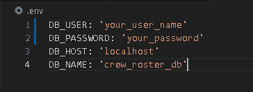
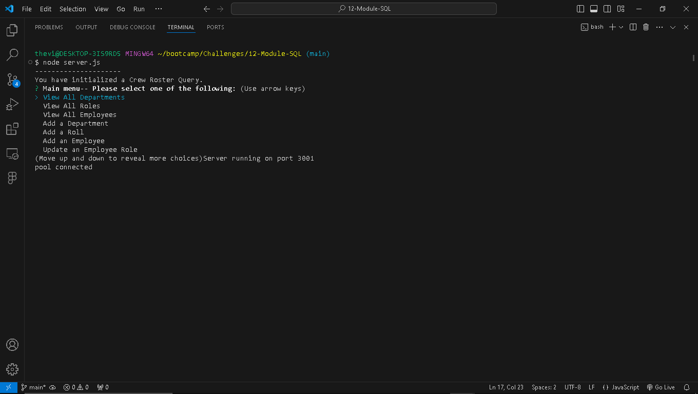
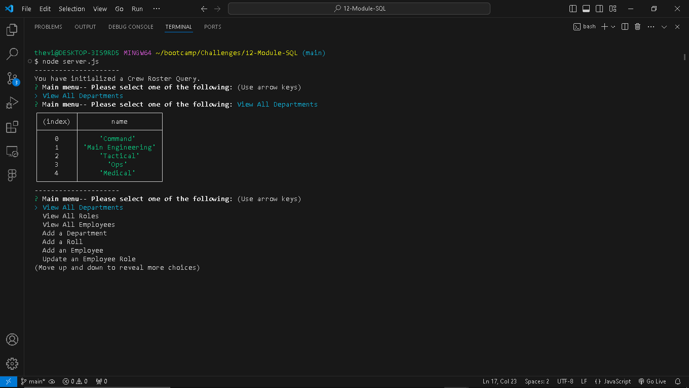
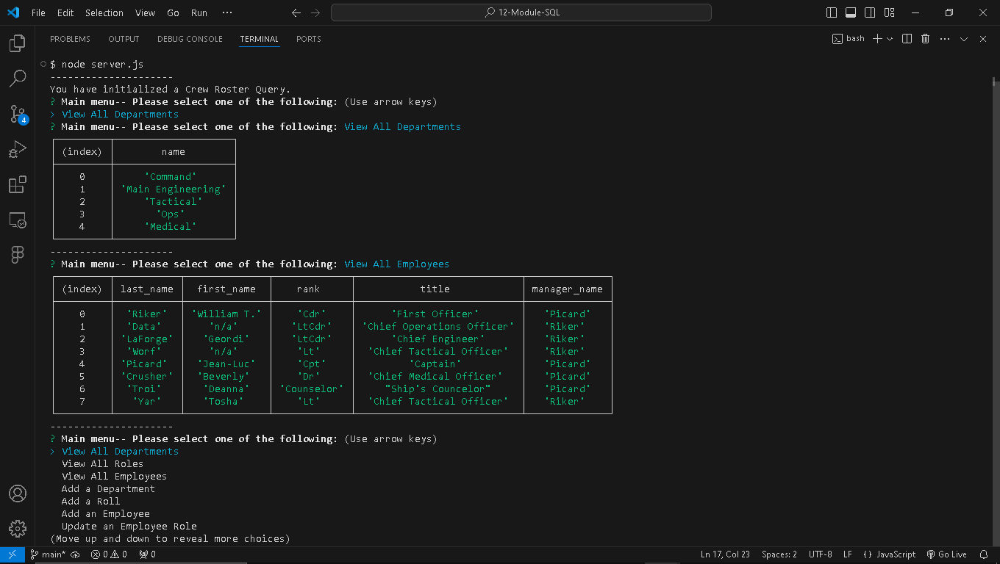

# Crew Roster Query
  [](https://opensource.org/licenses/MIT)
  ## Description
  This app enables users to query data about crew members of the U.S.S. Enterprise. By answering a few questions, users can view or update data for crew members, roles, and departments.
  ## Table of Contents

  1. [Installation](#Installation)
  2. [Usage](#Usage)
  3. [License](#License)
  4. [Questions](#Questions)

  ## Installaion
  To install the app, visit the GitHub repot here: [Crew RosterQuery GitHub Repo](https://github.com/Flem-House-Dev/Crew-Roster-Query), and clone the repo into a folder on your local machine.

  Next, build and seed the database. This can be done from the database management cli. Be sure that you are in the root directory of the project. Then, for Postgres the command to open the psql command line will be:
  ```
  psql -U postgres
  ```
  Please note that the default username is "postgres". If you have a different username, it will need to be changed.

  Next, from the postgres command line, run the following commands:

  ``` 
  \i db/schema.sql
  \i db/seeds.sql 
  ```

  Then, you will enter `\q` to exit the psql command line.

  If you are using a database management system other than Postgres, consult its documentation on how to access its command line and run sql files.
  
  ## Usage
  In order to run the app, the you will need to enter your database login credentials in the `.env` file which is located in the root directory.
  </br>
  You will want to replace `"your_user_name"` and `"your_password"` with your actual username and password. And, if applicable you will need to replace `"localhost"` with the actual host.</br>

  To start the app, run:
  ```
  node server.js
  ```
  Next, the app will open a series of prompts. The user will answer each one to either view, enter, or update data in the database.

 
  
 

  ***
  A video walk-through can be found at this link:</br>
  [Video Walk-through](https://drive.google.com/file/d/18HMehjJ5mQqXejcxFM01SFWLAWBI8Tbd/view?usp=sharing)

  ## License
  This software uses the MIT License.
  ## Questions
  To see more projects or to contribute, please visit my GitHub profile at: [JFleming963](https://github.com/Flem-House-Dev).
